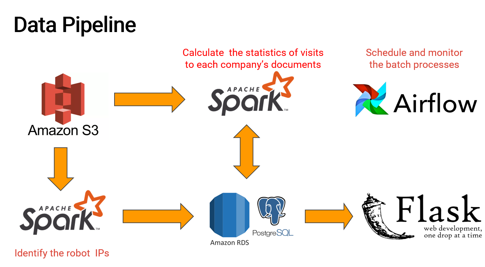

# Insight Project: CrawlTrawler
### *A tool to seperate bots from real users*

Analyzing the statistics of the users' visits to the websites of companies has been a common tool to understand customers' insterests and trend of products. However, the weblog files and pageview information often include activities of web crawlers (bots) which can mislead companies to draw wrong conclusions and thus make wrong decisions. This insight project aims to help companies identify and filter the web crawler activities, and precisely analyze their customers' behavior.


The dataset used in this study are EDGAR logfiles (millions of records per day) which stores user's access to the financial documents on [sec.org](https://www.sec.gov/dera/data). This work can also be extended to other companies such as e-commerce, digital media and so on, which have larger volume of visits every day.


The data pipeline consists of two batch processes:
1. identifying the robot IPs
2. filtering the detected robot IPs and calculate the user access statistics.


Apache Airflow is employed to schedule and monitor the daily batch jobs. The whole data pipeline is deployed on Amazon Web Services (AWS).





## Data Sources
Data were downloaded from [sec.org](https://www.sec.gov/dera/data) and then saved in AWS S3 Bucket. Details can be found in [src/Data/](src/Data/). In this project, logfiles in 2016 were processed (in total ~ 600GB).

## Cluster and Database
Install and configure [AWS CLI](https://aws.amazon.com/cli/) and [Pegasus](https://github.com/InsightDataScience/pegasus) on your local machine, and clone this repository using ```git clone https://github.com/mzhao15/Insight-Meng```.

Spin up a spark-cluster using Pegasus with following requirements:

- Spark-cluster: five m4.large AWS EC2 instances
- [AWS RDS PostgreSQL](https://docs.aws.amazon.com/AmazonRDS/latest/UserGuide/CHAP_GettingStarted.CreatingConnecting.PostgreSQL.html): one t2.micro AWS EC2 instance


Install following softwares/packages on cluster:
- Hadoop
- Spark
- Python package: psycopg2
    - ```pip install psycopg2-binary```

## Run Spark Jobs
Individual spark-batch job can be submitted with instructions in [docs/spark.txt](docs/spark.txt). Users can also run two spark jobs with following steps (Note: second job cannot start until the first one finishes):
1. ```cd src/Spark/```
2. ```./CrawlerFinder.sh```
3. ```./Total.sh```

## Run Airflow
The [Apache Airflow](https://airflow.apache.org/) can be installed on master node following instructions in [docs/airflow.md](docs/airflow.md) to install Airflow. Run airflow jobs:
```
cd src/Airflow/
./batch_scheduler.sh
```
Open another terminal and launch scheduler:
```
airflow scheduler
```
The batch jobs are set to execute on a daily basis. Users can manually trigger and monitor the DAG from Airflow GUI at ```http://<master-node-public-dns>:8081```.

## Run App
Use the command to start Flask server:
```
./app-run.sh
```
The Flask front-end can be viewed at [www.crawltrawler.site](www.crawltrawler.site).
